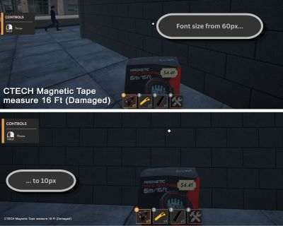
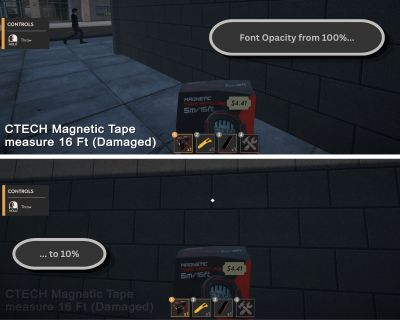
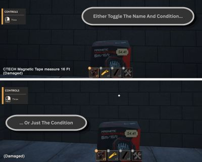

## Condition HUD

This is a mod I created that allows you to see the Name and Condition of the item(s) you are actively holding.  
This is the first mod I have ever created. Cheers!

#### REQUIREMENTS

Along with having the game...  
Make sure you have [BepInEx](https://www.nexusmods.com/returnsoutletsimulator/mods/2) installed. Their Nexus page that I have linked has a great step by step

Once you have BepInEx installed, here is how you will structure my plugin:  
_(this should be inside your game folder in C:\Program Files (x86)\Steam\steamapps\common\ )_

- Returns Outlet Simulator/
  - BepInEx/
    - plugins/
      - ConditionHUD/
        - ConditionHUD.dll

### FEATURES

#### Configure Font Size

#### Configure Font Opacity

#### Configure "Show Condition Only" Option

#### HotKey For Showing / Hiding HUD

You have the ability to toggle the HUD on and off with a changable hotkey. The default is F8, however this can be updated inside the Config File

### Settings/Config File

You can change the configurations mentioned above in the path below:

- Returns Outlet Simulator/
  - BepInEx/
    - config/
      - _tbroz.ros.conditionhud.cfg_
